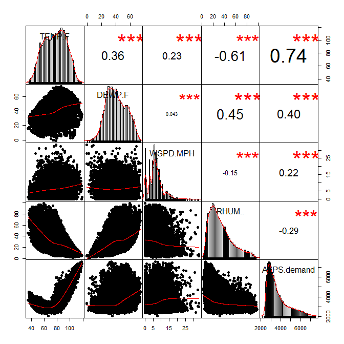
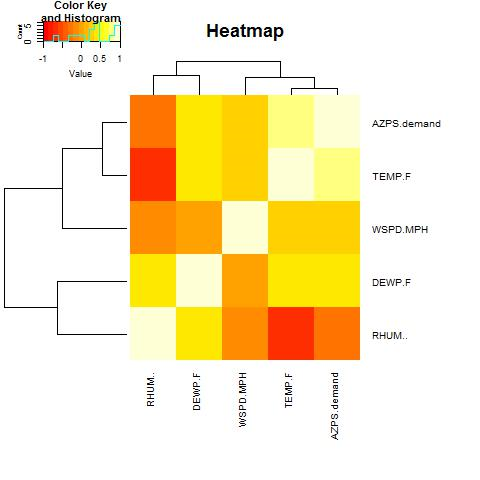
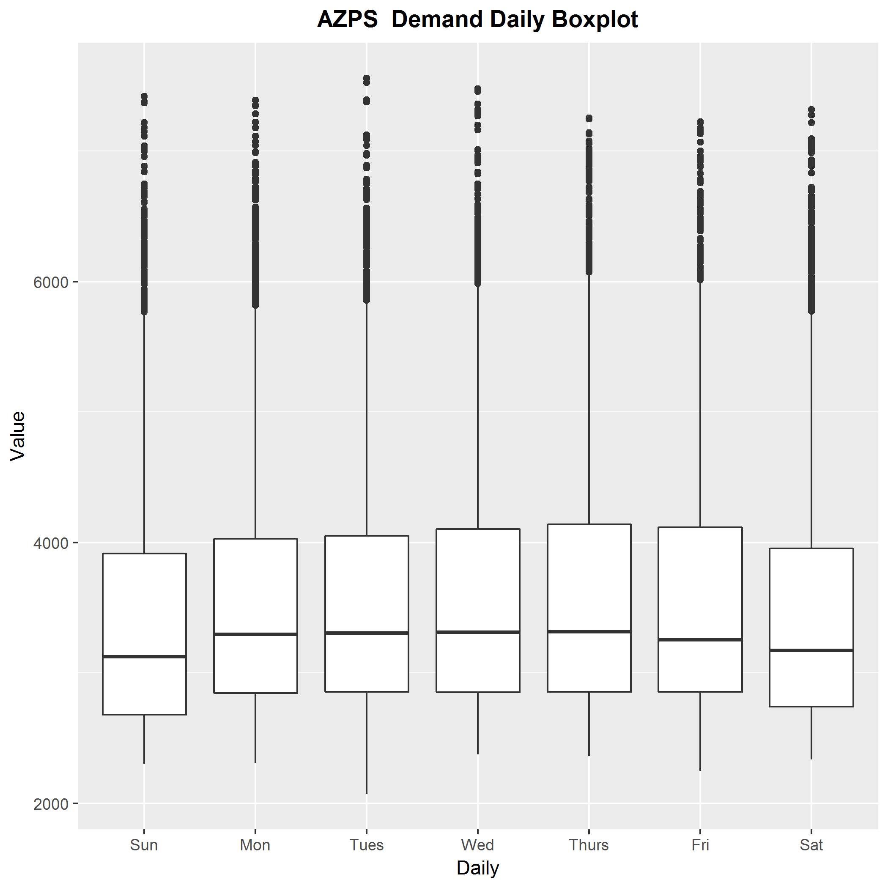

# The-relationship-between-Weather-Conditions-and-Electricity-Demand-in-the-South-of-United-States

In this project, in order to evaluate the level of power system risk due to abnormal load and air temperature, a statistical analysis of historical data is used. And some useful figures are plotted.

*Correlation coefficient plot*

*Heat map*

*Boxplot*
